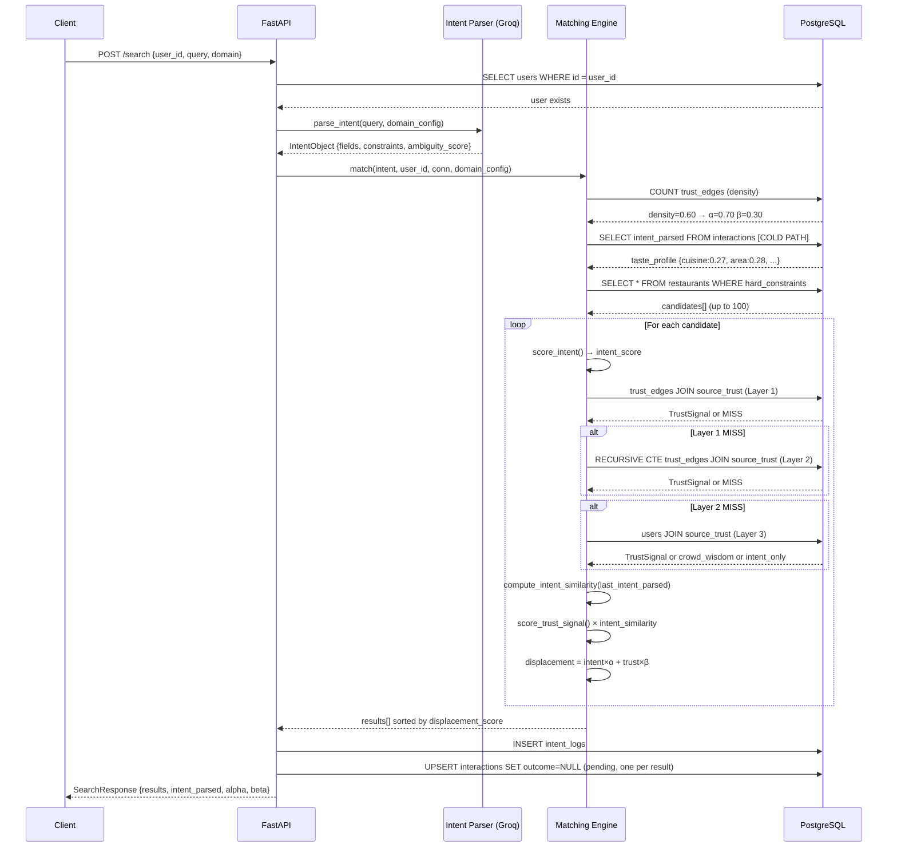
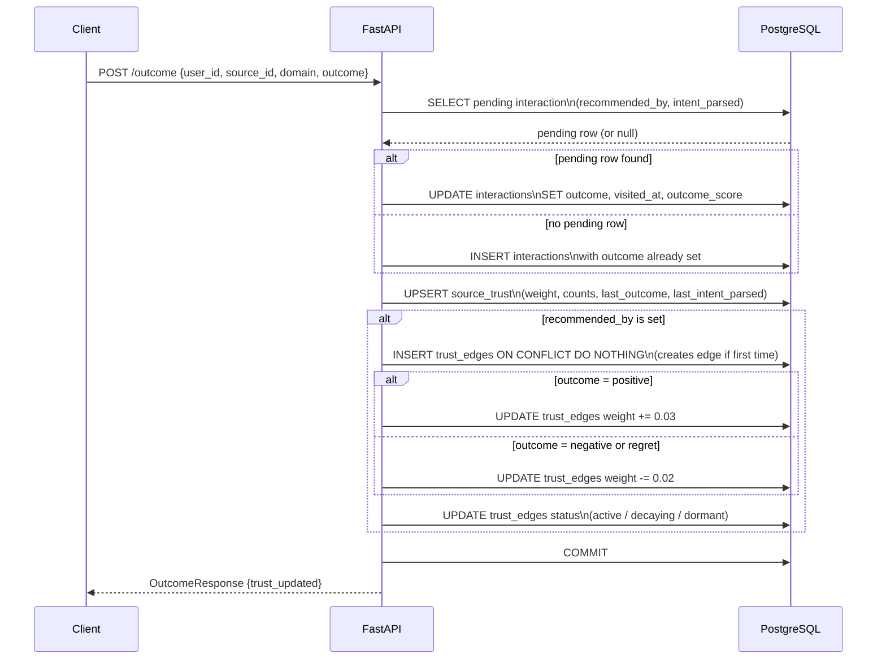
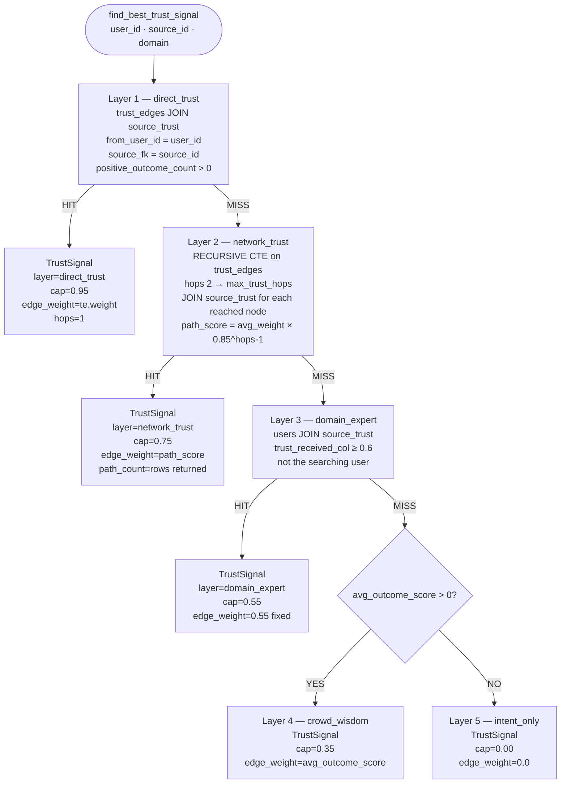
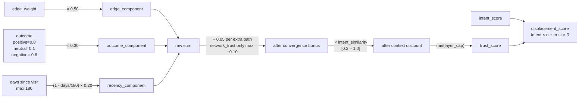
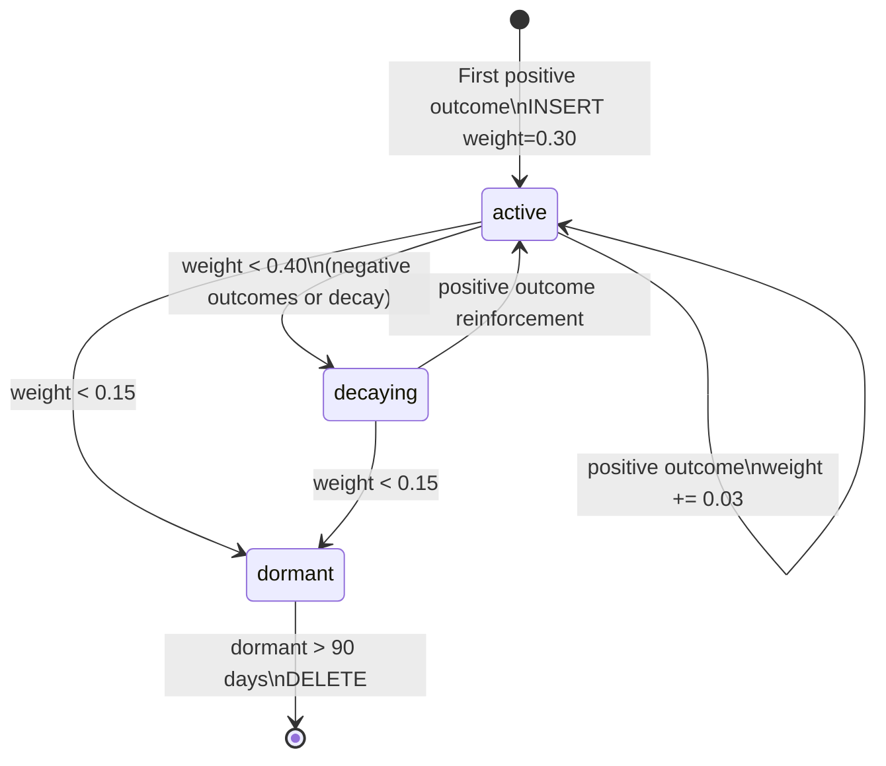

# Universal Connector — Low-Level Design

## 1. Table Roles

Every table has one job. Mixing responsibilities is the source of the architectural issues this document addresses.

| Table | Role | Query Path |
|---|---|---|
| `trust_edges` | User → User trust graph. The reasoning surface. | **HOT** — every search traversal |
| `source_trust` | User → Source visit history. Aggregated per visit. | **HOT** — every candidate lookup |
| `interactions` | Raw event log. One row per search, updated on outcome. | **COLD** — taste profile, audit |
| `intent_logs` | Search audit log. One row per search. | **COLD** — analytics only |
| `restaurants` / `products` | Source catalogue. Hard constraint filtering. | **HOT** — filter_candidates |
| `users` | Person nodes. Domain expert lookup. | **HOT** — domain_expert layer only |

---

## 2. Architectural Fixes Applied

### 2.1 Problems in the original design

| Problem | Impact |
|---|---|
| `find_best_trust_signal()` JOINs `interactions` in the recursive CTE | interactions grows unbounded; no composite index → full scan per graph node |
| `trust_edges` never created by the API — only seeded | Trust graph cannot grow organically from real usage |
| `source_trust` written on outcome but never read in matching | Aggregated data ignored; raw log queried instead |
| `ON CONFLICT (user_id, {fk})` on source_trust breaks for partial indexes | product_id conflict resolution silently fails |
| Missing `last_intent_parsed` on `source_trust` | Intent similarity forces a join to interactions even in the hot path |
| No composite index on `interactions(user_id, restaurant_id)` | JOIN pattern used in trust layers has no covering index |

### 2.2 Fixes

| Fix | File |
|---|---|
| Add `last_intent_parsed`, `last_outcome` to `source_trust` | migration 003 |
| Replace full unique constraint with partial index on `source_trust` | migration 003 |
| Add composite indexes on `interactions(user_id, source_id)` | migration 003 |
| Rewrite trust signal SQL to JOIN `trust_edges + source_trust` | matcher.py |
| `compute_intent_similarity()` reads `source_trust.last_intent_parsed` | matcher.py |
| `/outcome` creates trust edge if not exists (INSERT ON CONFLICT DO NOTHING) | api/main.py |
| `/outcome` writes `last_intent_parsed`, `last_outcome` to `source_trust` | api/main.py |
| Fix `source_trust` UPSERT to use partial index conflict target | api/main.py |

---

## 3. Write Path

### 3.1 POST /search

```
1. Validate user exists
2. parse_intent(query, domain_config)     → LLM call → IntentObject
3. match(intent, user_id, conn, config)
   3a. get_trust_graph_density()          → alpha / beta
   3b. load_user_taste_profile()          → personalized weights  [COLD — reads interactions]
   3c. filter_candidates()               → hard constraint SQL on source table
   3d. For each candidate:
       score_intent()                    → intent_score
       find_best_trust_signal()          → TrustSignal           [HOT — trust_edges + source_trust]
       compute_intent_similarity()       → similarity multiplier [HOT — source_trust.last_intent_parsed]
       score_trust_signal()              → trust_score
       compute_displacement_score()      → displacement_score
4. Sort by displacement_score DESC
5. INSERT intent_logs (audit)
6. UPSERT interactions per result (outcome=NULL)   ← pending row
7. Return SearchResponse
```

### 3.2 POST /outcome

```
1. Validate outcome value
2. Resolve domain_config
3. SELECT pending interaction
   → get: recommended_by, trust_path_weight, trust_hops, intent_parsed
4. UPDATE interaction (outcome, outcome_score, visited_at)
   OR INSERT if no pending row exists
5. UPSERT source_trust
   → update: weight, visit counts, last_visited_at, last_outcome, last_intent_parsed
6. If recommended_by is set:
   6a. INSERT trust_edge ON CONFLICT DO NOTHING   ← creates edge if new relationship
   6b. UPDATE trust_edge weight (+0.03 positive / -0.02 negative)
   6c. UPDATE trust_edge status (active / decaying / dormant)
7. Commit
8. Return OutcomeResponse
```

---

## 4. Read Path (Matching Engine)

### 4.1 match() orchestration

```
match(intent, user_id, conn, domain_config, top_k)
│
├── get_trust_graph_density(trust_edges)
│       COUNT active edges for user → density
│       density < 0.3 → α=0.85, β=0.15   (intent-heavy, sparse graph)
│       density < 0.7 → α=0.70, β=0.30   (balanced)
│       density ≥ 0.7 → α=0.55, β=0.45   (trust-heavy, dense graph)
│
├── load_user_taste_profile(interactions)          [COLD PATH]
│       Scan last 20 positive interactions
│       Count which fields appeared (hard=2×, soft=1×)
│       Blend 50/50 with domain defaults
│       Normalize → {field: personalized_weight}
│       Falls back to domain defaults if < 5 interactions
│
├── filter_candidates(source_table, hard_constraints)
│       Builds SQL WHERE from DomainConfig.filterable_fields()
│       Hard cuisine → AND cuisine && ARRAY[...]::text[]
│       Hard area    → AND area = %s
│       Hard parking → AND parking = true
│       Returns up to 100 candidates
│       Zero results → relax relaxable hard constraints → retry
│
└── For each candidate:
    ├── score_intent(source, intent, domain_config, taste_profile)
    │       For each scored field with non-empty intent value:
    │         list   → overlap ratio or similarity_map score
    │         string → 1.0 exact / 0.3 soft mismatch / 0.0 hard mismatch
    │         bool   → 1.0 match / 0.3 mismatch
    │       Weighted sum using taste_profile weights
    │       Ambiguity floor: if ambiguity_score > 0.7 → score ≥ 0.4
    │
    ├── find_best_trust_signal(trust_edges, source_trust)  [HOT PATH]
    │       Layer 1: direct_trust      → trust_edges JOIN source_trust (1 hop)
    │       Layer 2: network_trust     → RECURSIVE CTE trust_edges JOIN source_trust
    │       Layer 3: domain_expert     → users JOIN source_trust
    │       Layer 4: crowd_wisdom      → avg_outcome_score from source row
    │       Layer 5: intent_only       → no signal
    │
    ├── compute_intent_similarity(current_intent, source_trust.last_intent_parsed)
    │       Compare field by field: current intent vs past visit context
    │       Returns multiplier [0.2, 1.0]
    │       Only applied to direct_trust and network_trust layers
    │
    ├── score_trust_signal(signal, intent_similarity)
    │       edge_component    = edge_weight × 0.50
    │       outcome_component = outcome_score × 0.30
    │       recency_component = (1 - days/180) × 0.20
    │       raw = sum of above
    │       network_trust: +0.05 per extra convergent path (max +0.10)
    │       raw × intent_similarity
    │       min(layer_cap, raw)
    │
    └── compute_displacement_score()
            (intent_score × α) + (trust_score × β)
```

### 4.2 find_best_trust_signal — Layer SQL (after fix)

**Layer 1 — direct_trust**
```sql
SELECT te.to_user_id, u.name, te.weight,
       st.last_outcome, st.last_visited_at, st.last_intent_parsed
FROM trust_edges te
JOIN users u        ON u.id = te.to_user_id
JOIN source_trust st ON st.user_id = te.to_user_id
                     AND st.{source_fk} = %s
                     AND st.domain = %s
WHERE te.from_user_id = %s
  AND te.status = 'active' AND te.domain = %s
  AND st.positive_outcome_count > 0
ORDER BY te.weight DESC, st.last_visited_at DESC
LIMIT 1
```

**Layer 2 — network_trust (recursive CTE)**
```sql
WITH RECURSIVE trust_paths AS (
    SELECT te.to_user_id AS reached_user, te.weight AS avg_weight,
           1 AS hops, ARRAY[te.to_user_id]::uuid[] AS visited
    FROM trust_edges te
    WHERE te.from_user_id = %s AND te.status = 'active' AND te.domain = %s
    UNION ALL
    SELECT te.to_user_id, (tp.avg_weight + te.weight) / 2,
           tp.hops + 1, tp.visited || te.to_user_id
    FROM trust_paths tp
    JOIN trust_edges te ON te.from_user_id = tp.reached_user
    WHERE tp.hops < %s AND te.status = 'active' AND te.domain = %s
      AND NOT te.to_user_id = ANY(tp.visited)
)
SELECT tp.reached_user, u.name,
       ROUND((tp.avg_weight * POWER(0.85::float, tp.hops-1))::numeric, 3) AS path_score,
       tp.hops, st.last_outcome, st.last_visited_at, st.last_intent_parsed
FROM trust_paths tp
JOIN users u         ON u.id = tp.reached_user
JOIN source_trust st ON st.user_id = tp.reached_user
                     AND st.{source_fk} = %s AND st.domain = %s
WHERE st.positive_outcome_count > 0 AND tp.hops >= 2
ORDER BY path_score DESC
LIMIT 3
```

**Layer 3 — domain_expert**
```sql
SELECT u.id, u.name, st.last_outcome, st.last_visited_at
FROM users u
JOIN source_trust st ON st.user_id = u.id
                     AND st.{source_fk} = %s AND st.domain = %s
WHERE u.id != %s
  AND u.{trust_col} >= 0.6
  AND st.positive_outcome_count > 0
ORDER BY u.{trust_col} DESC, st.last_visited_at DESC
LIMIT 1
```

---

## 5. Trust Edge Lifecycle

```
First recommendation outcome recorded (recommended_by set):
    INSERT trust_edges (weight=0.30, basis='implicit')
    ON CONFLICT DO NOTHING                              ← creates edge if new

Subsequent outcomes:
    positive → weight += 0.03, last_reinforced_at = now
    negative → weight -= 0.02
    neutral  → no weight change

Status transitions (after each weight change):
    weight < 0.15 → dormant   (excluded from traversal)
    weight < 0.40 → decaying  (included but low signal)
    weight ≥ 0.40 → active

Scheduled decay (scripts/decay_trust.py — run daily):
    weight = weight × e^(-decay_rate × days_inactive)
    dormant > 90 days → DELETE
```

---

## 6. Score Caps by Layer

```
direct_trust   0.95   Personal, 1-hop, validated by outcome
network_trust  0.75   Personal, multi-hop, decays with distance
domain_expert  0.55   Not personal but high-trust voice in domain
crowd_wisdom   0.35   Aggregate signal, no personal connection
intent_only    0.00   No trust signal — intent match only
```

Even if the raw computation exceeds the cap, the cap is enforced. This is how the hierarchy is preserved regardless of data quality within a layer.

---

## 7. Mermaid Diagrams

### 7.1 Write Path — POST /search



### 7.2 Write Path — POST /outcome



### 7.3 Read Path — find_best_trust_signal (5-layer hierarchy)



### 7.4 Trust Score Computation



### 7.5 Trust Edge Lifecycle



---

## 8. Schema Changes (Migration 003)

```sql
-- source_trust: add context columns for hot-path intent similarity
ALTER TABLE source_trust
    ADD COLUMN IF NOT EXISTS last_intent_parsed JSONB,
    ADD COLUMN IF NOT EXISTS last_outcome       TEXT;

-- source_trust: replace full unique constraint with partial index
-- so ON CONFLICT (user_id, {fk}) WHERE {fk} IS NOT NULL works for all domains
ALTER TABLE source_trust DROP CONSTRAINT IF EXISTS unique_source_trust;
CREATE UNIQUE INDEX IF NOT EXISTS idx_source_trust_restaurant
    ON source_trust(user_id, restaurant_id) WHERE restaurant_id IS NOT NULL;
-- idx_source_trust_product already created in migration 002

-- interactions: composite indexes for the (user_id, source_id) JOIN pattern
CREATE INDEX IF NOT EXISTS idx_interactions_user_restaurant
    ON interactions(user_id, restaurant_id);
CREATE INDEX IF NOT EXISTS idx_interactions_user_product
    ON interactions(user_id, product_id);

-- source_trust: indexes for the source lookup in trust signal layers
CREATE INDEX IF NOT EXISTS idx_source_trust_restaurant_domain
    ON source_trust(restaurant_id, domain);
CREATE INDEX IF NOT EXISTS idx_source_trust_product_domain
    ON source_trust(product_id, domain);
```

---

## 9. Key Invariants

1. **interactions rows are never deleted** — they are the permanent audit log.
2. **Every trust_edge.weight change is driven by an interaction outcome** — no arbitrary weight editing.
3. **source_trust.last_intent_parsed is always from the most recent completed interaction** — it overwrites on every outcome, never accumulates.
4. **The 5-layer fallback always returns a TrustSignal** — the engine never returns None or raises on a trust lookup.
5. **Layer caps are enforced after all computation** — a direct_trust signal can never score above 0.95 regardless of raw value.
6. **α > β always** — intent is always the primary signal; trust is the tiebreaker and personalizer.
